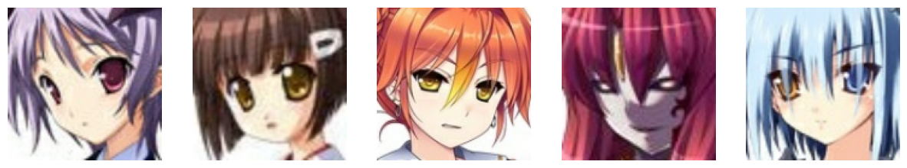

# VAE-Anime-Cartoon

- [VAE-Anime-Cartoon](#vae-anime-cartoon)
  - [Introduction](#introduction)
  - [Datasets](#datasets)
  - [Model](#model)
    - [Encoder](#encoder)
    - [Decoder](#decoder)
    - [Loss Function](#loss-function)
  - [Results](#results)
    - [Reconstruction](#reconstruction)
    - [Noise](#noise)
  - [Conclusion](#conclusion)
  - [Contributors](#contributors)

## Introduction

This notebook is a simple implementation of a Variational Autoencoder (VAE) using PyTorch. The VAE is a generative model that learns to encode and decode data.

## Datasets

The model is trained on [Anime Face dataset](https://www.kaggle.com/datasets/splcher/animefacedataset) and [Cartoon face dataset](https://www.kaggle.com/datasets/brendanartley/cartoon-faces-googles-cartoon-set), both of which are famous datasets.

Some samples of the dataset are shown below:

## Model

A VAE consists of two main components:

1. **Encoder**: Maps the input data to a latent space.
2. **Decoder**: Reconstructs the data from the latent space.

### Encoder

The encoder maps the input data $x$ to a latent variable $z$. Instead of mapping $x$ to a single point in the latent space, the encoder maps $x$ to a distribution over the latent space. This is typically done using a neural network that outputs the mean $\mu$ and the standard deviation $\sigma$ of a Gaussian distribution.

The latent variable $z $is then sampled from this distribution:
$$z \sim \mathcal{N}(\mu, \sigma^2) $$

### Decoder

The decoder maps the latent variable $z $back to the data space to reconstruct the input data $x $. This is also done using a neural network.

### Loss Function

The loss function of a VAE consists of two parts:

1. **Reconstruction Loss**: Measures how well the decoder can reconstruct the input data from the latent variable.
2. **KL Divergence**: Measures how close the learned latent distribution is to the prior distribution (usually a standard normal distribution).

The total loss is given by:
$$ \mathcal{L} = \mathbb{E}_{q(z|x)}[\log p(x|z)] - \text{KL}(q(z|x) \| p(z)) $$

Where:

- $q(z|x)$ is the approximate posterior distribution (output of the encoder).
- $p(x|z)$ is the likelihood of the data given the latent variable (output of the decoder).
- $p(z)$ is the prior distribution (usually a standard normal distribution).

Our model consists of two fully convoluted neural networks, one for the encoder and one for the decoder.

## Results

The generated images are shown below:

### Reconstruction

### Noise

## Conclusion

It can be seen that using a VAE, the model can learn to reconstruct the data from the latent space, also if we give the decoder a noise input, we can generate new images which doesn't exists, this application can be useful for data augmentation or many other things.

## Contributors

- [Matin Bazrafshan](https://github.com/FabulousMatin)
- [Shahriar Attar](https://github.com/Shahriar-0)
